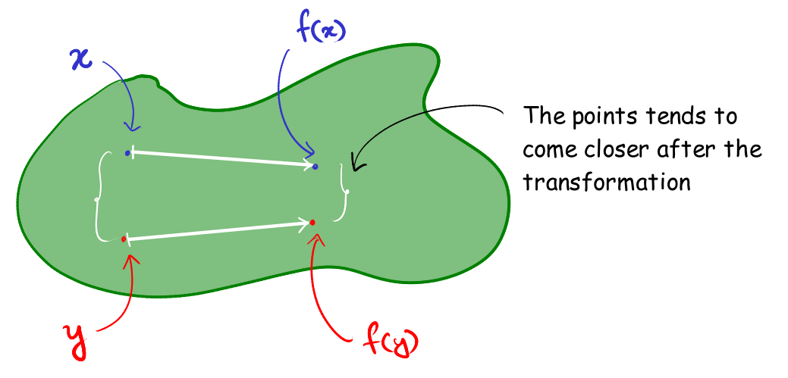
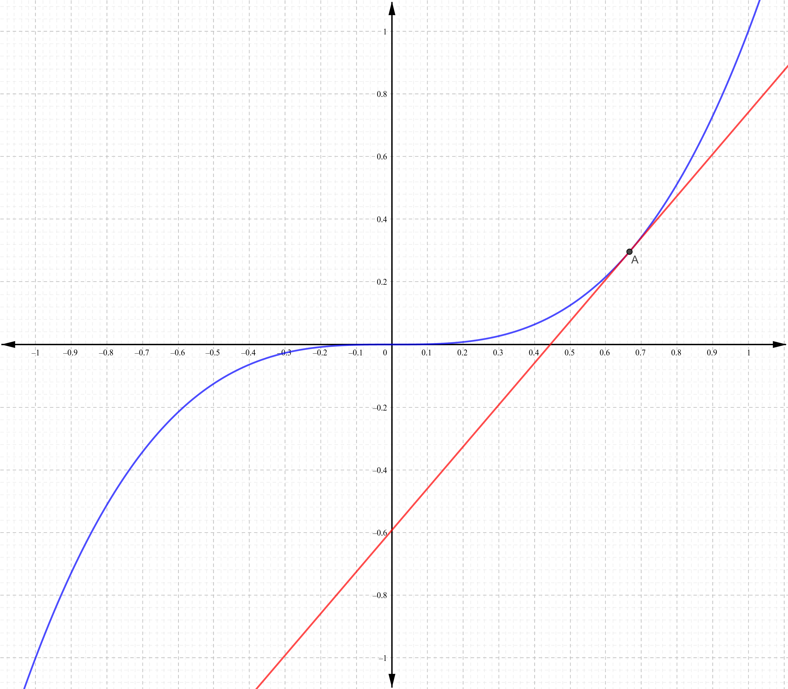
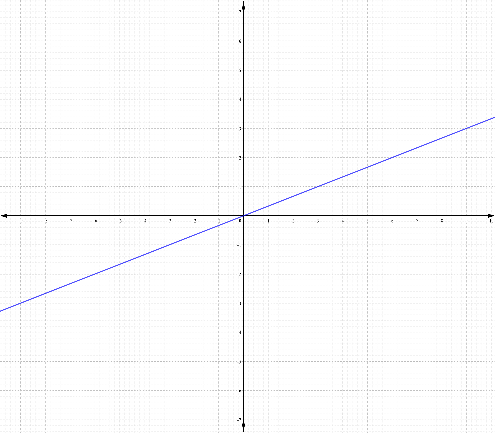
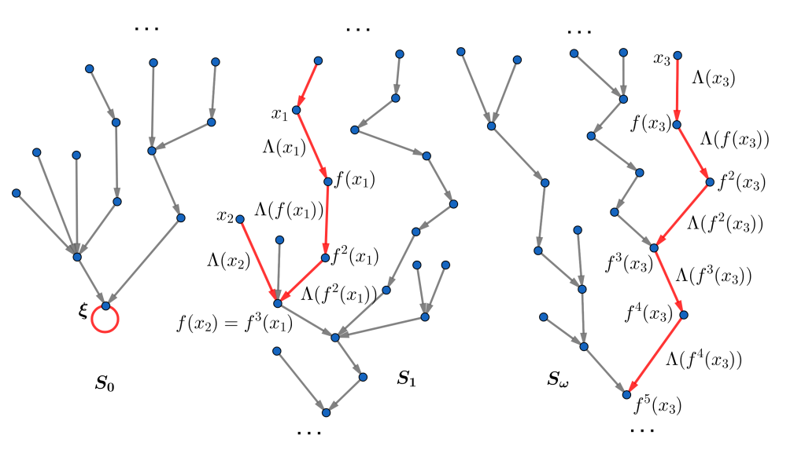



When I was earlier studying at Ramakrishna Mission, Belur they had organized a presentation competition among the Mathematics undergraduate and postgraduate students. It was essentially aimed for encouraging students to look at real world research papers, and try to find motivation from them to create a short presentation on a particular topic. The only restriction was that the contestants had to choose a topic from Real Analysis, Complex Analysis, Measure Theory or Functional Analysis. 

Being a first-year undergrad I was very excited about the contest, but on the other hand I had very little idea of the other topics except Real Analysis (by very little, I almost mean "absolutely no idea"). So I decided (literally that was my only option) that I will create a presentation regarding something from Real Analysis. 

I sat down for a while and started thinking about the topics that I could use. My first thought was about **Intermediate Value Theorem** but later on I decided to talk on **Fixed Point Theory**, or more precisely **Metric Fixed Point Theory**. Before going into details let me give you an idea about fixed points and what exactly Fixed Point Theory is?

## What is a fixed point ? 

In plane terms fixed points are the points which remain invariant after a certain transformation (or a function). Basically let $X$ be a non-empty set and $f : X \to X$ be a function then $ x_0 \in X $ is said to be a **fixed point** of $f$ if $ f(x_0)=x_0$.

Fixed Point Theory covers all the theorems related to fixed points of a function, and Metric Fixed Point Theory mostly covers topics from Fixed Point Theory in which metric spaces play a fundamental role.

At first I was bushing around the thought of talking on either **Banach Contraction Principle (BCP)** or **Brouwer's Fixed Point Theorem**. After few days of googling and going through some books I came across **Bessaga's Converse** to BCP and I found it quite interesting and I finally decided that - _"Yep, this is going to be my topic"_.

## Overview of the Presentation

Banach's Fixed Point Theorem or also known as Banach Contraction Principle is quite famous, and it is also regarded as the universal method for establishing that a function has an unique fixed point. You have done an introductory course on metric spaces, you must have come across this in almost all the text books.

>**Theorem (Banach's Fixed Point Theorem).** *Let $ (X,d)$ be a **complete metric space** and let $ f : X \to X$ be a **contraction map** with respect to the metric $ d$, i.e, $ \exists \ \alpha \in [0,1)$ such that $ \forall \ x,y \in X$ we have* \begin{equation}
   d(f(x),f(y)) \leq \alpha d(x,y) \label{eq1}\tag{1}
\end{equation} *then $f^{n}$ has an unique fixed point, where $f^n = f \circ f^{n-1} \ \forall \, n \in \mathbb{N}$.* 

I started of by briefly discussing about Banach's theorem, and its consequences and intricacies. My initial sketch was to talk on the following stuffs 

**Basic observations regarding contraction map.**

*A vague idea of contraction map*

>**Lipschitz maps.**_Let $(X,d)$ be a metric space, then a function $f : X \to X$ is said to be a **Lipschitz map** if there exists some $\alpha \geq 0$ such that_ \begin{equation}
    d(f(x), f(y)) \leq \alpha d(x,y) \quad \forall \, x,y \in X 
\end{equation}

- Clearly you have the set of contraction maps are a subset of Lipschitz maps, and its a trivial exercise to show that any Lipschitz map is a continuous function. Thus you have contraction maps are continuous. 
- Any contraction map can have at most one fixed point. Well just for the sake of contradiction suppose you get a contraction that has two distinct fixed points, say $a$ and $b$, then you have 
    \begin{align}
        d(a,b) = d(f(a), f(b)) \leq \alpha d(a,b) \Rightarrow (1-\alpha) d(a,b) \leq 0
    \end{align}
    but you have both $(1-\alpha) > 0$ and $d(a,b) > 0$ and thus $(1-\alpha)d(a,b) > 0$ (Contradiction!)

**Why Completeness is necessary condition ?**
  
- A simple counter example to show that a contraction map in an incomplete metric space may not have an unique fixed point is the function $f : (0,1] \to (0,1]$ given by \begin{equation} f(x) = \frac{x}{2} \ \forall \, x \in (0,1]\end{equation}  Evidently this function is a contraction map with respect to the standard Euclidean metric $d(x,y) = \|x - y\|$, but clearly $f$ has no fixed point in the set $(0,1]$. 
- Now consider the same function $f$ but the domain to be $X := [0,1]$, then with respect to the standard Euclidean metric $X$ is a complete metric space, and thus by Banach's theorem $f$ has an unique fixed point which is precisely, the point $0$. 

**Does a contraction map, with an unique fixed point implies that the metric space is complete?**

- In our previous example if we consider the domain to be $ X' := [0,1) $ even then the function $ f$ has an unique fixed point, but clearly $ X'$ is not a complete metric space as the Cauchy sequence $ \\{ 1 - \frac{1}{n} \\}_{n=1}^{\infty}$ does not converge in $ X'$. Thus a contraction map may have an unique fixed point but that does not guarantee us that the metric space in which it is defined is complete.

>In fact there are many examples of incomplete metric spaces in which every contraction map has an unique fixed point. Thus Banach Contraction Principle does not imply metric completeness. But if you are interested to know about contraction maps that implies metric completeness then do check out **Kannan-type contraction maps**. There is a nice paper in which Dr. P.V. Subrahmanyam showed that Kannan-type contraction characterizes metric completeness [4].
{: .prompt-tip}

**Does every function with an unique fixed point is a contraction map, i.e. it satisfies BCP?**

- So consider the function $ f : (-1,1) \to (-1,1) $ given by $ f(x)=x^3$, clearly this function has an unique fixed point, but is it a contraction map ? Well, if you consider the standard Euclidean metric then definitely this is not a contraction map, because at some point the slope of the tangent is strictly greater than one. 

- But if you consider the metric to be this weird guy 

    $$ \displaystyle{d(x,y) = \left| \frac{\mathrm{sgn}(x)}{\ln{|x|}} - \frac{\mathrm{sgn}(x)}{\ln{|y|}} \right| \quad \forall \, x,y \in (-1,1)} $$

    it turns with respect to the metric $ d, \ f$ is a contraction map. 


  
  

*Plot of $f$ with respect to the euclidean metric (left) and with respect to the metric $d$ (right)*

The very natural and obvious question over here would be - Can we always find such a 'weird' or you may call it a 'good' metric ? This is when Bessaga's theorem comes to light!

>**Theorem (Bessaga's Converse to BCP):** *Let $ f : X \to X$ be a function such that $ \forall \ n \in \mathbb{N}$ we have $ f^n : X \to X$ has an unique fixed point, then $ \forall \ c \in (0,1)$ there exists a metric $ d_{c} : X^2 \to [0,\infty)$ such that $ \displaystyle{d_c(f(x),f(y)) \leq c d_c(x,y) \ \forall \ x,y \in X}$.*

My talk mainly revolved around idea of Bessaga's Converse to BCP, and how it establishes the fact that Banach's Fixed Point Theorem cannot be improved further. In this regard I like to share the quote from the book Handbook of Analysis and its Foundation (HAF) by Eric Schechter, [1]

>Although Banach theorem is quiet easy to prove, but a longer proof cannot yield stronger results. 

In fact I would suggest everyone to go through the book - 'Handbook of Analysis and its Foundation' by Eric Schechter, it is a pretty amazing book that explores some of the topics that everyone of us come across while reading analysis to a great depth. Also if you have read Analysis by Tom Apostol or Walter Rudin, you will definitely love the book.

The one thing that I really liked about the Bessaga's Converse to BCP, is its innovative idea. Before going into that consider this example - suppose I have a connected graph $ \mathcal{G}$ and for any two vertices $ u,v \in \mathcal{G}$ we define 

$$d(u,v) := \mbox{length of the shortest path connecting $v$ and $u$}$$

then you can observe that $ (\mathcal{G},d)$ forms a metric space. A similar idea is used to proof Bessaga's theorem.

Basically you look at the elements of the set $X$ as vertices of a graph and draw a directed edge from $x \mapsto f(x)$ and label this edge by $ \Lambda(x)$ where $ \Lambda : X \to (0,\infty)$ ($ \Lambda$ will br defined later). Actually what you do is you treat $\Lambda(x)$ as the length of the edge $ x \mapsto f(x)$. The fact that $f^n$ has an unique fixed point for all $ n \in \mathbb{N}$ ensures that this graph has no loops except a trivial loop (a cycle consisting of only one element) at $ \xi$, where $ \xi$ is the unique fixed point of $ f^n \ \forall \ n \in \mathbb{N}$. Thus this graph is a tree if we neglect the point $ \xi$.

*Its almost a tree*

Now whenever two points are connected you define the distance between them to be the length of the shortest path connecting them. But now the problem is - it's not necessary that all the points are connected. If two points $ x,y $ are not connected you define the distance between then to be 

$$\displaystyle{ d(x,y) = \sum_{j=0}^{p} \Lambda(f^j(x)) + \sum_{j=0}^q \Lambda(f^j(y)) } $$ 

where $ p $ and $ q$ are natural numbers where the branch of our tree originating respectively at $ x$ and $ y$ finally terminate. A small observation over here is - as $ x,y$ are not connected thus either one of $ p,q$ is infinite.

The next problem that arises in front of us - does the infinite series $ \sum_{j=0}^{\infty} \Lambda(f^j(x))$ always converges (of course whenever it matters) ? This is where you need to define $ \Lambda$ to meet our convenience.

>**Lemma:** *For all choices of $ \Lambda$ such that $ \sum_{j=0}^{\infty} \Lambda(f^j(x))$ converges then it turns out that $ (X,d)$ is a metric space, which is popularly called the **Bessaga Brunner Metric**.*

This where the book HAF, provides a brilliant idea. I will not go into further details about it, but if you really want to know about it in details you can go through the chapter 19 of HAF, or you may also see section 3 in my [notes](BCP.pdf) directly, where I've talked about all these much more rigorously.

## Outcome of the Presentation

I had very little expectation that I will get any rewards from this presentation. Mostly I wanted to showcase something new and gain some experience from this event. My previous experience at conducting a student's colloquium was not so satisfying. 

During my first colloquium I had observed that my lecture was a way too lengthy, and because of that I was not able to explain everything as I wanted due to the time hurdle. Also previous time after the colloquium talking to some of my professors and friends I realized that each slide of my presentation contained way too much of text and to be honest even if you are giving a lecture to a very elite committee, its never easy for the listener to go through all the text at once.

So this time I tried to avoid my previous mistakes. One thing I would like to say over here is - "Make sure that your presentation is absolutely meaningless without you" (one of my professors said me this). Basically the presentation is just medium for the listeners to see only the key results or facts. Its you who has to bring out the value from your presentation by your voice (you can do a lot of practice in front of the mirror to improve your speech), some blackboard activity or some digital animation (if it is possible). A very simple way to known that your presentation is ready to be delivered is to check this two things - 

- See if you go through all the slides, you see that you have covered all the important details. 
- Give your presentation to one of your friends and ask them to go through it (you will do nothing to explain them your presentation), if they can understand your presentation then it means that there is some scope to improve in your presentation, i.e. you can brief out some more texts or information. 

I tried to follow all these tips and as it turned out the judges really liked my presentation and I also felt very satisfied after giving the presentation (it really felt a lot better than my first colloquium). In fact I was nominated as the winner, that felt really nice as I had put in a lot of efforts into it! I would really suggest any one to participate in this kind of events whenever it is possible, as truly said by one of the greatest teacher and researcher of all time Richard Feynman -
>If you want to master something, teach it.

## References

1. Eric Schechter. Handbook of Analysis and its Foundations
2. Tom Apostol. Mathematical Analysis or Walter Rudin. Principles of Mathematical Analysis
3. Czełsaw Bessaga. On the converse of Banach ”fixed-point principle”. Colloquium Mathematicum, 7:41–43, 1959
4. Subrahmanyam P.V. Remarks on some fixed-point theorems related to Banach’s contraction principle. Journal of Mathematical and Physical Sciences, 8, 01 1974
