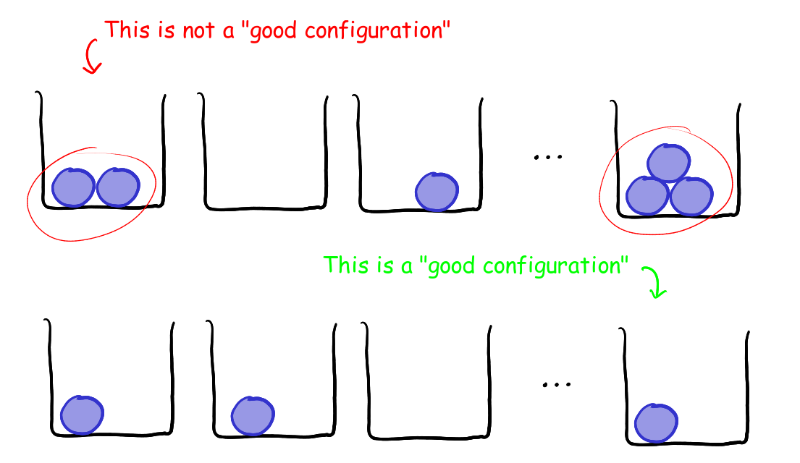
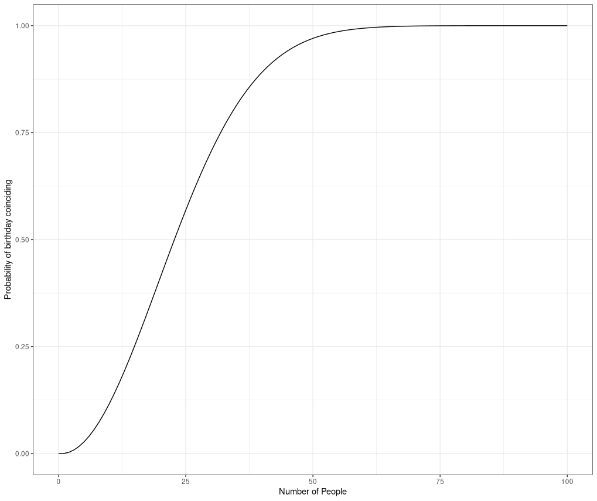
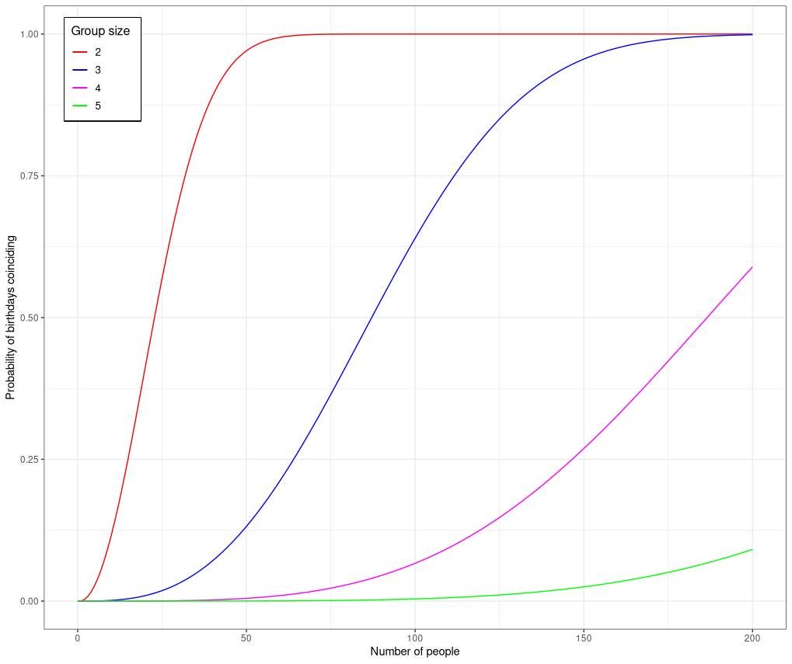



The other day, my brother came to me excited saying that he had an amazing day today, as two of his classmates had their birthdays together, and they decided to give them a great treat. He asked me:

>Isn't that surprising that out of only $25$ people both of them had their birthday on the same day?

I replied to that:

>Good that you had a nice day, but actually speaking the event you are talking about is not at all so surprising.
<!--more-->
---

He was amazed at my claim, and wanted to know more, I've seen he likes to get to know the reason behind something, in fact I really like the fact that he gets interested whenever somebody is talking about mathematics in general. So I decided it's a good time to tell him what I really meant.

If you have ever attended a first course in introduction to probability or statistics, you must have come across the birthday problem, in which case you might find this blog a little cliche and boring, but still I believe a lot of you might not have seen the generalized version of the birthday problem, in which case there's something out there for you. To start from the scratch the birthday problem stated nicely it goes like this:

## What is the birthday problem? 

>**Birthday problem.** _In a group of $n$ people what is the probability that two people share the same birthday? (Ofcourse we take $n$ to be much smaller than $365$ as otherwise there's no fun)._

For simplicity I will assume that there $365$ distinct days (i.e., we ignore leap years) and throughout this blog I assume that a person is equally likely to born on any of the $365$ distinct days. For brevity purpose I assume $d = 365$.

Now let's try to compute the probability that two people among $n$ people share the same birthday. Now its actually easier to compute the probability that among a group of $n$ people there exists no two people sharing the same birthday (call this event $E_n$), then you get

$$\mathbb{P}(E_n) = \frac{n!}{d^n} \binom{d}{n}$$

this can be seen easily by rephrasing the problem a little bit, you consider the people to be distinct balls, and the $d$ possible birthdays to be $d$ distinct boxes, and the event $E_n$ is simply asking the following question: How many ways can you place $n$ distinct balls in $d$ distinct boxes, such that no box contains more than one ball? For example take $n = 6$ then



So for a configuration to be _"good"_ you need that each ball goes to a distinct box, but then you can easily count all those _"good configuration"_ by first choosing $n$ boxes out of $d$ boxes, and then permuting the balls in this $n$ boxes, which gives you total number of "good configurations" is $n! \binom{d}{n}$, but then since there are total $d^n$ possible configurations, you get $\mathbb{P}(E_n) = \frac{n!}{d^n} \binom{d}{n}$.

Now the probability that among a group of $n$ people two people share the same birthday (call this event $G_n$) follows immediately as, 

$$\label{eq1}\tag{1} \mathbb{P}(G_n) = 1 - \mathbb{P}(E_n) = 1 - \frac{n!}{d^n} \binom{d}{n}$$


*Figure 1: Probability of birthdays of two people coinciding*

Now if you use a calculator and plug in $n = 23$, in equation $(\ref{eq1})$, then you will get $\mathbb{P}(G_{23}) = 0.5073$, which agrees with my intial claim I had made to my brother. The figure just above gives the plot of probability of two people sharing the same birthday as $n$ increases. As you might see from the figure, $\mathbb{P}(G_n) \approx 1$ for $n \geq 75$, when I told this to my brother his immediate reaction was:

>Wait I've has been to meetings or classes with more than $75$ people yet many a times I don't find a friend who has the same birthday as mine.

My brother's doubt is obvious and it seems he is that unlucky guy who is contradicting the birthday problem, but its actually not quite so, this is because he is asking a completely different question.

## Why do People think the Birthday Problem is Paradoxical? 

Well the two questions: What is the probability that among a group of $n$ people two people share the same birthday? and what is the probability that there is person among the other $n-1$ people who shares the same birthday as mine? are completely different.

For the sake of fun let's compute the other probability too, i.e., what is the probability that among the other $n-1$ people there's a person sharing same birthday as mine (call this event $A_n$). Now once again its easier to compute the probability of the completement of the event $A_n$, i.e., probability that among the other $n-1$ people there's no one sharing birthday with me, call this event $B_n$. Then assume that my birthday is $1^{st}$ January, then if you once again look at the ball and box configuration, the event $B_n$ is just asking the quesion: How many ways can you place $n-1$ distinct balls in $d$ distinct boxes, such that box number $1$ remains empty? But now I guess you can answer this easily, what you get is 

$$\mathbb{P}(B_n) = \left( \frac{d-1}{d} \right)^{n-1}$$

And thus eventually I get 

$$\mathbb{P}(A_n) = 1 - \left( \frac{d-1}{d} \right)^{n-1} \label{eq2}\tag{2}$$

, along with probability of one person shares the same birthday as you (blue)")
*Probability of birthdays of two people coinciding (red), along with probability of one person shares the same birthday as you (blue)*

In above figure the blue plot is the plot of probability that there's one person among the other $n-1$ people sharing the same birthday as mine, and the red plot is that of the among a group of $n$ people, two people share the same birthday. Now you can clearly see that the blue plot grows very slowly as compared to the red plot, thus its evident that though there's a highly likely that two people may share the same birthday, but its not so likely that I might find a friend sharing same birthday as mine. This is actually the reason why people sometimes think its highly unlikely that in a group of people, there might exists two people sharing the same birthday, as they start to think from their perspective, which gives rise to the birthday paradox!

For fun you might even try out to ask- What is the probability that among a group of $n$ people there are $m < n$ people sharing the same birthday? Well you can try to find out the probabilities for this kind of events too, but unfortunately the resulting probabilities don't have a good closed form like in the case of $m = 2$. But nevertheless I consider this as the **generalized birthday problem**.

## The Generalized Birthday Problem 

>_**Generalized Birthday Problem.** What is the probability that among a group of $n$ people there are $m < n$ people sharing the same birthday?_

Let $\mathbb{P}(G_{m,n})$ denote the probability that among a group of $n$ people there exists $m$ people sharing the same birthday, then it can be shown that 

$$\mathbb{P}(G_{m,n}) = 1 - \sum_{\underset{t_i < m}{\sum_{i=1}^d t_i = n}} \binom{n}{t_1, \dots ,t_d} d^{-n} \label{eq3}\tag{3}$$

the idea of the proof, works on the similar line you define the event $E_{m,n}$ be the event that in a group of $n$ people there doesn't exists a group of $m$ people sharing the same birthday, then it can be shown that 

$$\mathbb{P}(E_{m,n}) = \sum_{\underset{t_i < m}{\sum_{i=1}^d t_i = n}} \binom{n}{t_1, \dots ,t_d} d^{-n} $$

Now if you try to compute the probability $\mathbb{P}(E_{m,n})$ the first thing that stucks you is: now we may have people sharing the same birthday as long as the number of people sharing that same birthday is less than $m$. So let's try to go back to our balls and boxes configurations. The question now you have to answer is: How many ways can you place $n$ distinct balls in $d$ distinct boxes, such that every box contains less than $m$ balls?

I suggest you do the following, you let $t_i$ denote the number of balls in box $i$, where $i = 1,\dots,d$. Then you obviously have 

$$ t_1 + t_2 + \cdots +  t_d = n $$

Now the number of ways to place $n$ distinct balls into $d$ distinct boxes so that box $i$ gets $t_i$ many balls is given by the multinomial coefficient

$$ \binom{n}{t_1, t_2, \dots , t_d} $$

Now, you are almost done, you just need to add the condition that $t_i < m$ for all $i = 1,\dots,d$. And then what you get is the total number of *"good configurations"* is:

$$ \sum_{\underset{t_i < m}{\sum_{i=1}^d t_i = n}} \binom{n}{t_1, \dots, t_d} $$

and hence you have actually proved

$$ \mathbb{P}(E_{m,n}) = \sum_{\underset{t_i < m}{\sum_{i=1}^d t_i = n}} \binom{n}{t_1, \dots ,t_d} d^{-n} $$

which directly gives you equation (\ref{eq3}).


*Probabilities of $m$ people sharing the same birthday, for $m=2,3,4$ and $5$*

Now if you don't know about things such as random variables, then what follows from here on might not make sense to you. What I now show is how to represent proof for equation (\ref{eq3}) using the language of random variables.

You let $B_1, \dots, B_n \overset{iid}{\sim} \mathsf{Unif}\\{1,\dots,d\\}$, and define the random variables $n_i$ for $i \in \\{1,\dots,d\\}$ as follows:

$$ n_i = \\# \\{ j \mid B_j = i \\} \quad \forall \\, i \in \\{ 1,\dots,d \\}$$

and finally you consider the random vector $\tilde{X} = (n_1, \dots, n_d) $ then it trivially follows that 

$$ \tilde{X} \sim \mathsf{Mult}\left(n \, ; \frac{1}{d}, \dots, \frac{1}{d}\right) \label{eq4}\tag{4}$$

and hence a CDF $F_{\tilde{X}}$ for the random vector $\tilde{X}$ is given by 

$$ F_{\tilde{X}}(m_1,\dots,m_d) = \mathbb{P}(n_1 < m_1, \dots, n_d < m_d) = \sum_{\underset{t_i < m_i}{\sum_{i=1}^d t_i = n}} \binom{n}{t_1,\dots,t_d} d^{-n}$$

but then you simply get 

\begin{align}
    \mathbb{P}(E_{m,n}) 
    &= \mathbb{P}(\max \\{n_1, \dots, n_d\\} < m) \\\\\
    &= \mathbb{P}(n_1 < m, \dots, n_d < m) \\\\\
    &= \sum_{\underset{t_i < m}{\sum_{i=1}^d t_i = n}} \binom{n}{t_1,\dots,t_d} d^{-n}
\end{align}

You can actually use this setup to simulate your own birthday problem, like if you are familiar with $\texttt{R}$ you can do the following:

```R
birthdays <- 1:365
numPeople <- 1:200

maxCoincidence <- function(n){
     return(max(table(sample(birthdays, n, replace=TRUE))))
} #  returns the maximum repetition of a birthday

# main function to do the simulation
genBirthdayProblem <- function(N,m,iterate){
    p = rep(0,length(N))
    for(n in N){
        p[n] <- mean(replicate(iterate, maxCoincidence(n) >= m))
    }
    return(p)
}
```

Nice, right? What else can we do? Can we find a closed form for $\mathbb{P}(E_{m,n})$? Well sadly I couldn't make much progress on this one, what I could show is this one:

\begin{equation}
     \mathbb{P}(E_{m,n}) = \sum_{\underset{\sum_{k=0}^{m-1} u_k = d}{\sum_{k=0}^{m-1} ku_k = n}} \binom{d}{u_0, \dots, u_{m-1}} \left(\frac{n!}{\prod_{k=0}^{m-1}(k!)^{u_k}}\right) d^{-n} \label{eq5}\tag{5}
\end{equation}

equation (\ref{eq5}) looks pretty awful :face_with_head_bandage:, but I included it because it sort of gives a decent formula for $\mathbb{P}(E_{3,n})$, if you just plug in $m=3$ in equation (\ref{eq5}), upon trivial simplification you will get 

$$ \mathbb{P}(E_{3,n}) = \sum_{u=0}^{\left\lfloor \frac{n}{2} \right\rfloor} \binom{d}{u,n-2u,d-n+u} \left( \frac{n!}{2^u} \right) d^{-n} $$
